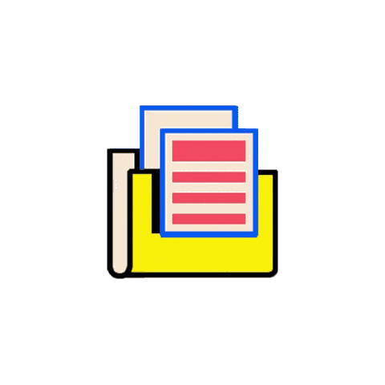

### **Hey** 

  

  

###  **About**

<samp>
I’m currently learning Java & Python  
How to reach me: <a href="sbilalulhassan4@gmail.com">sbilalulhassan@gmail.com</a>  
Discord: <a href="https://discordapp.com/users/725620582942507065" target="_blank">BilloXD</a>  
Instagram: <a href="https://instagram.com/ig.billo" target="_blank">ig.billo</a>  
Snapchat: <a href="https://www.snapchat.com/add/ig.billo" target="_blank">ig.billo</a>  
<a href="https://www.buymeacoffee.com/">Buy Me A Coffee</a>
</samp>

  

###  **Skills**

<samp>
I have experience using these tools and languages.    
</samp>

  

###  **Extras**

 &nbsp;

  

###  **Let's Connect**

<!-- Discord -->

&nbsp;
<!-- Twitter -->

<samp>It's a pleasure to make your acquaintance. 😊</samp>

<!--
**BilloXD** is a ✨ _special_ ✨ repository because its `README.md` (this file) appears on your GitHub profile.

Here are some ideas to get you started:

- 🔭 I’m currently working on ...
- 🌱 I’m currently learning ...
- 👯 I’m looking to collaborate on ...
- 🤔 I’m looking for help with ...
- 💬 Ask me about ...
- 📫 How to reach me: ...
- 😄 Pronouns: ...
- ⚡ Fun fact: ...
-->
